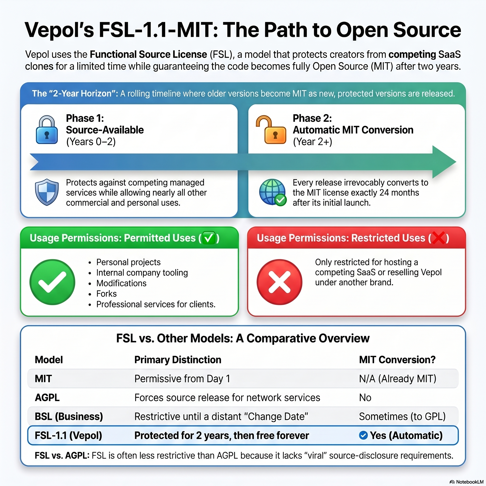
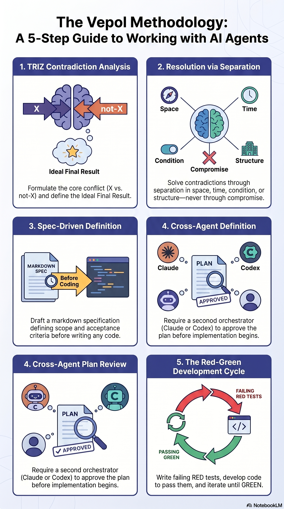

# Vepol — Visual Documentation

This folder collects visual and high-density text artefacts that explain
Vepol in different formats. They are **regenerated**, not hand-drawn — the
source of truth is the public docs in this repo (`README.md`,
`docs/what-is-vepol.md`, `LICENSE-FUTURE.md`, `COMMERCIAL.md`,
`claude/CLAUDE.md`, `knowledge/CLAUDE.md`). Each artefact was generated via
Google NotebookLM.

If the public docs change materially, regenerate with the procedure noted at
the bottom of this file.

---

## 1. Autonomy growth — how the partnership compounds over time ⭐

The core product story in one image: how Vepol's autonomy increases day by
day, week by week. Day 1 (assisted drafting), Week 2 (intelligent filter),
Month 2 (trusted proxy), Month 6 (autonomous partner — half of operational
routine runs on its own). Plus the Governance Layer (audit trail +
cross-agent review gate) and Health & Goal Alignment as a brake on overload.


**File:** `vepol-autonomy-growth.png` · landscape · editorial style · ~5.5 MB

---

## 2. Architecture overview

Visual map of how the human, AI agents, and the markdown knowledge base form
a TRIZ substance-field model. Shows core/user-overlay separation, the
`.managed.yaml` manifest boundary, and the three-tier repository strategy
(`vepol` public · `vepol-source` private staging · `vepol-pro` private
commercial).


**File:** `vepol-architecture.png` · landscape · professional style · ~4.3 MB

---

## 3. License model (FSL-1.1-MIT)

How Vepol's licensing works in two phases: **source-available** for the first
2 years (free for personal use, internal company use, professional services
to clients, modifications, forks — restricted **only** for hosted competing
services), then **automatic conversion to MIT**. Side-by-side comparison
with MIT, AGPL, and BSL.



**File:** `vepol-license.png` · square · bento-grid style · ~4.0 MB

---

## 4. Working methodology

The 5-step Vepol methodology applied during work with AI agents: TRIZ
contradiction analysis → resolution via separation (space / time / condition
/ structure, not compromise) → spec-driven definition → cross-agent plan
review → red-green development cycle.



**File:** `vepol-methodology.png` · portrait · instructional style · ~4.0 MB

---

## 5. Mind map

Hierarchical map of Vepol's concepts: core idea, architecture and components,
knowledge structure, workflow principles, license model, automation
features, and operational discipline.

GitHub renders the Mermaid diagram inline when you open the file:

→ **[vepol-mindmap.md](vepol-mindmap.md)** (Mermaid mindmap, native render)
→ **[vepol-mindmap.json](vepol-mindmap.json)** (JSON tree, for external tools)

---

## 6. Briefing document

Executive-summary-style document covering Vepol's core paradigm
(partnership and agency), the 6-month autonomy progression, governance,
health/goal alignment, and architecture. Suitable for sharing with someone
evaluating whether to adopt Vepol.

→ **[vepol-briefing.md](vepol-briefing.md)** (~190 lines, plain markdown)

---

## How these were generated

All artefacts in this folder were created with [Google NotebookLM](https://notebooklm.google.com/)
via its CLI ([notebooklm-py](https://github.com/teng-lin/notebooklm-py)). The
notebook used the public docs of this repo as sources.

To regenerate after material doc changes:

```bash
# Authenticate once
notebooklm login

# Create a fresh notebook + load the public docs
notebooklm create "Vepol — Visual Documentation"
notebooklm source add README.md
notebooklm source add docs/what-is-vepol.md       # primary framing source
notebooklm source add LICENSE-FUTURE.md
notebooklm source add COMMERCIAL.md
notebooklm source add claude/CLAUDE.md
notebooklm source add knowledge/CLAUDE.md

# Wait for sources to index (~30-60s), then generate
notebooklm generate mind-map
notebooklm generate infographic "Autonomy growth: Day 1 → Month 6 progression with governance + health alignment" --orientation landscape --style editorial
notebooklm generate infographic "Architecture overview..." --orientation landscape --style professional
notebooklm generate infographic "FSL license model..." --orientation square --style bento-grid
notebooklm generate infographic "Working methodology..." --orientation portrait --style instructional
notebooklm generate report --format briefing-doc --append "Frame as autonomous AI partner, not memory tool"

# Wait for completion (5-15 min each), then download
notebooklm artifact list
notebooklm download infographic docs/visuals/vepol-autonomy-growth.png -a <id>
# … etc
```

---

## License note

The visual artefacts in this folder are licensed under the same
[FSL-1.1-MIT](../../LICENSE) terms as the rest of Vepol. They include the
small NotebookLM watermark (bottom-right corner) per Google's terms of use;
that watermark is part of the deliverable and should not be cropped out.
