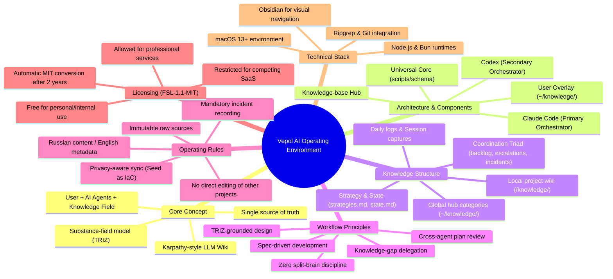

# Vepol — Mind Map

Visual map of the system, generated from Vepol's public docs (README, LICENSE-FUTURE, COMMERCIAL, methodology, hub schema).

GitHub renders the diagram below natively. For an editable JSON tree (use with mind-map tools), see `vepol-mindmap.json` in this folder.

---

*Generated via NotebookLM (Google) from public Vepol documentation. Re-generate with `notebooklm generate mind-map` after major doc changes.*